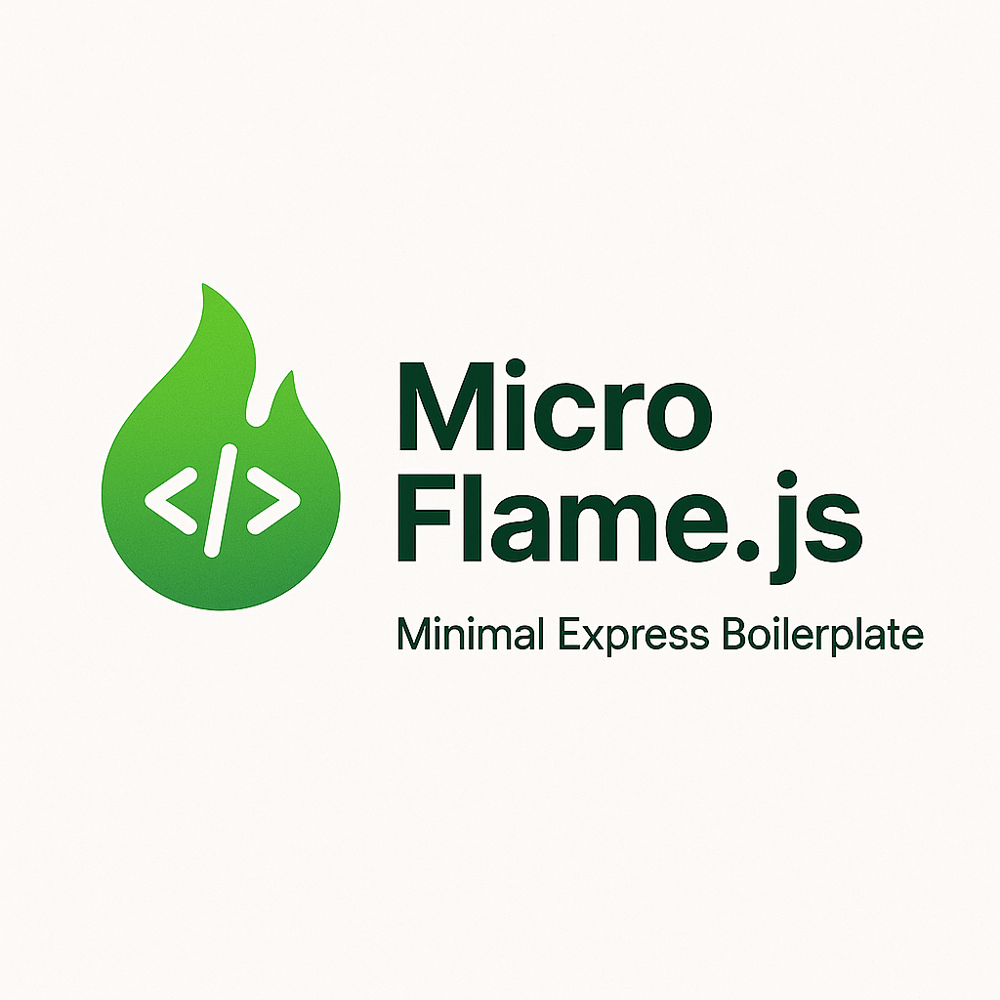

# 🔥 MicroFlame.js



A minimal and powerful Node.js boilerplate generator for MVC-style Express applications. MicroFlame doesn't reinvent the wheel — it uses well-known, battle-tested libraries like **Express**, **Mongoose**, **Winston**, and more — directly and transparently. It also comes with built-in scaffolding support to help you ship faster!

---

## ✨ Features

- 📦 Uses Express, Mongoose, and Winston with zero wrapping
- 🏗️ Scaffold models, views, controllers, and routes easily
- 🚀 Initialize a fully structured project in seconds
- ⚙️ Add environment variables across all environments with one command

---

## 🚀 Getting Started

### 1. Install MicroFlame CLI globally

```bash
npm install -g microflame
```

---

### 2. Initialize a New Project

```bash
microflame init my-app
```

This will:

- Create a new directory `my-app`
- Copy the base project boilerplate
- Print instructions for running the development server

**Next Steps:**

```bash
cd my-app
npm install
# Fill in your environment variables in .env.development
npm run dev
```

---

## 🛠️ CLI Commands

### 📦 `init`

Create a new MicroFlame project:

```bash
microflame init <directory>
```

This command initializes a new project in the specified directory.

**Example:**

```bash
microflame init my-new-app
```

---

### ⚙️ `generate` (alias: `g`)

Scaffold components for your app:

#### Controller

```bash
microflame generate controller user --mode api
```

This generates a new controller for the `user` resource, with an API mode.

**Example:**

```bash
microflame generate controller user --mode views
```

#### Model

```bash
microflame generate model user
```

This generates a model for the `user` resource.

**Example:**

```bash
microflame generate model post
```

#### View

```bash
microflame generate view home
```

This generates a view template for the `home` page.

**Example:**

```bash
microflame generate view about
```

#### Route

```bash
microflame generate route user
```

This generates a route for the `user` resource.

**Example:**

```bash
microflame generate route post
```

---

### 🔐 `add-env`

Add a new environment variable to `.env.development`, `.env.production`, and the config system:

**Example:**

```bash
microflame add-env TEMPLATE_JWTPRIVATEKEY mySecretKey true
```

This adds a new environment variable called `TEMPLATE_JWTPRIVATEKEY` with the value `mySecretKey` and marks it as required (`true`).

## 📁 Project Code Structure

A detailed explanation of the project architecture, folder structure, and best practices will be added soon. Stay tuned!

➡️ [Code Structure Guide](./docs/code-structure.md)

---

## ❤️ Contributing

If you'd like to contribute to MicroFlame, feel free to submit a pull request or open an issue.

---

## 📃 License

MIT License

---

## 🧯 Author

Built with care by Yaman Arab(Github: Yaman-cyber) 🛠️
